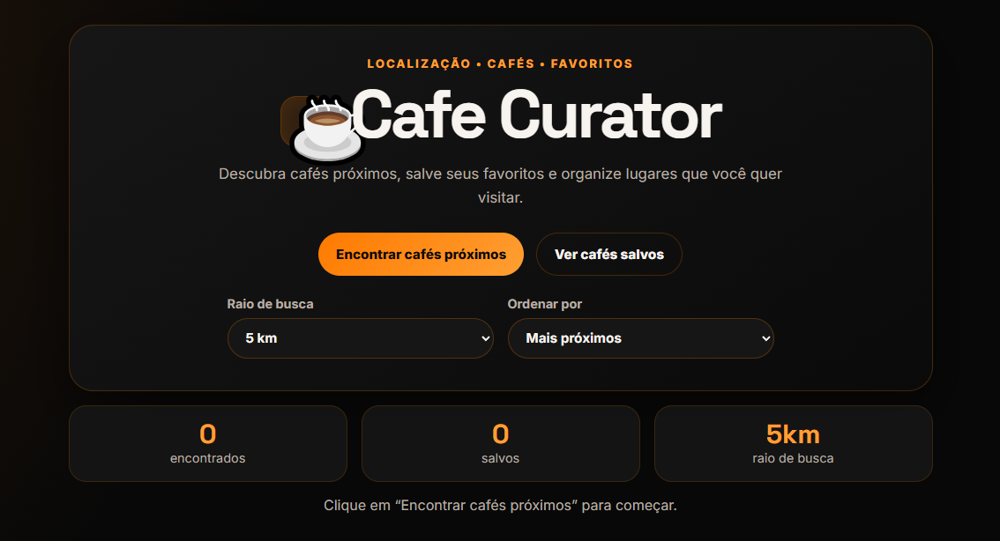
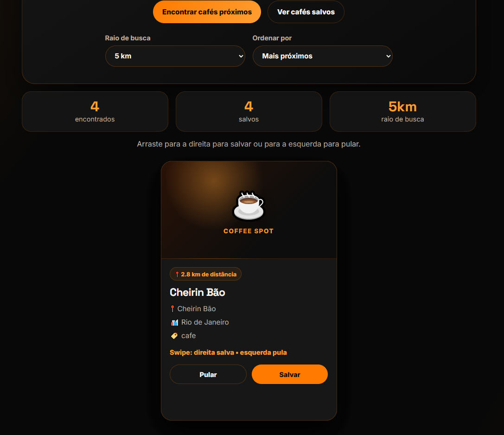
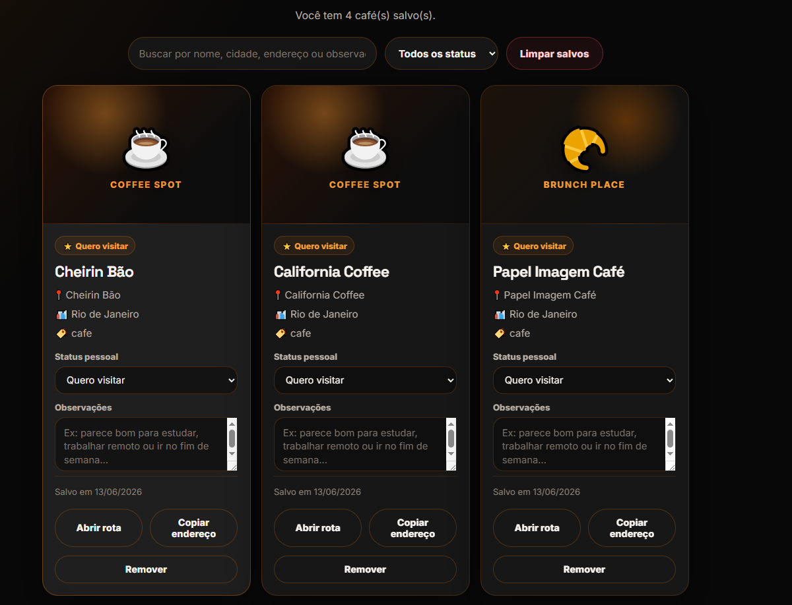

## 🌐 Demo

<a href="https://ryluna19.github.io/PCafe_Proximos/index.html" target="_blank">
    Abrir Cafe Curator
</a>


# ☕ Cafe Curator

Cafe Curator is a location-based web application that helps users discover nearby cafes, save favorite places and organize them with personal notes.

The project was built with HTML, CSS and JavaScript, using the browser Geolocation API, Geoapify Places API and localStorage.



## 📌 About the Project

Cafe Curator was created as a portfolio project focused on front-end fundamentals, API consumption and user interaction.

The application allows users to search for cafes near their current location, adjust the search radius, sort results, save favorite cafes and manage saved places with personal status and notes.

## 🚀 Features

* Search for nearby cafes using geolocation
* Custom search radius
* Sort results by distance or name
* Swipe cards to save or skip cafes
* Save favorite cafes using localStorage
* Filter saved cafes by name, city, address, notes or status
* Add personal status to saved cafes
* Add notes to saved cafes
* Copy cafe address
* Open cafe location on Google Maps
* Responsive layout
* Dark theme with orange visual identity

## 🛠️ Technologies Used

* HTML5
* CSS3
* JavaScript
* Geoapify Places API
* Browser Geolocation API
* localStorage
* HammerJS

## 📸 Screenshots

### Home / Search



### Saved Cafes



## 📂 Project Structure

```text
Cafe-Curator/
├── assets/
│   ├── preview.png
│   ├── screenshot-home.png
│   └── screenshot-saved.png
├── index.html
├── styles.css
├── stuff.js
├── README.md
├── .gitignore
└── .env.example
```

## ⚙️ How to Run

1. Clone this repository:

```bash
git clone https://github.com/Ryluna19/cafe-curator.git
```

2. Open the project folder:

```bash
cd cafe-curator
```

3. Open `index.html` in your browser.

The browser may ask for location permission. Allow it to search for nearby cafes.

## 🔑 API Key Note

This project uses the Geoapify Places API.

Since this is a static HTML, CSS and JavaScript project, the API key is currently used on the front-end. For a real production environment, the recommended approach would be to restrict the API key by domain in the Geoapify dashboard or move the request logic to a back-end service.

An `.env.example` file is included only as documentation for future improvements.

## 🧠 What I Practiced

With this project, I practiced:

* Consuming external APIs
* Working with geolocation
* Rendering dynamic content with JavaScript
* Managing data with localStorage
* Creating reusable functions
* Handling user interactions
* Building responsive layouts
* Improving UI/UX with a consistent visual identity
* Organizing a project for GitHub

## 📌 Future Improvements

Possible improvements for future versions:

* Use a back-end to protect the API key
* Add real cafe images when available from an API
* Add categories beyond cafes
* Add a map view
* Improve accessibility
* Add automated tests

## 👨‍💻 Author

Developed by Ryan Santos.

* GitHub: [github.com/Ryluna19](https://github.com/Ryluna19)
* LinkedIn: [Ryan Santos](https://www.linkedin.com/in/ryan-bulhoes-santos-560b25225)
